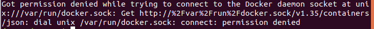

## Docker Question

**Permission**
Getting permission denied when typing docker on bash shell 

This is because the current user is not in the docker group.
if current user have sudo authority,then you can add to the docker group with two ways below, bash command: 
1. `sudo usermod -a -G docker username`
2. `sudo gpasswd -a username docker`

Verify that your user has been added to docker group by listing the users of the group with command `groups`. You probably have to log out and log in back again. Or user command `newgrp docker` to switch to docker group.

if the current user don't have sudo authority, then you must switch to another user that have sudo authority. The user `root` always does. 
The bash command changing user:
`su root` (Need password, if you don't known the password, then ask the man who knowns)
Then add the user to the docker group with one of the way below:
1. usermod -a -G docker username
2. gpasswd -a username docker

Next switch to the current user: `su username`

Verify that your user has been added to docker group by listing the users of the group with command `groups`. You probably have to log out and log in back again. Or user command `newgrp docker` to switch to docker group.

If there is `docker` on the group list, it is ok.

If there still error.Then you can try the way below:
`sudo chown root:docker /var/run/docker.sock`

In some case, it will be ok just by switching between `root` user and current user.
Run `su root`, then `su username`.
 